# 00 — How a blog post becomes a podcast episode with nobody watching

> Read this first. Each heading is the question we had to answer; under it is
> how we answered it — as a diagram where one says it better than prose.
> `01-pipeline.md` is the command reference, `02-workflow-tutorial.md` the
> by-hand walkthrough, `runner/` the CI machine.

---

## 1. Why are we doing this at all?

**Problem.** A blog post needs your eyes and ten quiet minutes. Most of the
day is not like that — the bus, the walk, the kitchen, the gym. That time is
when people actually have room for an idea, and a post can't reach them there.
An episode can: press play, keep your hands and eyes free, arrive with the
two or three things worth remembering.

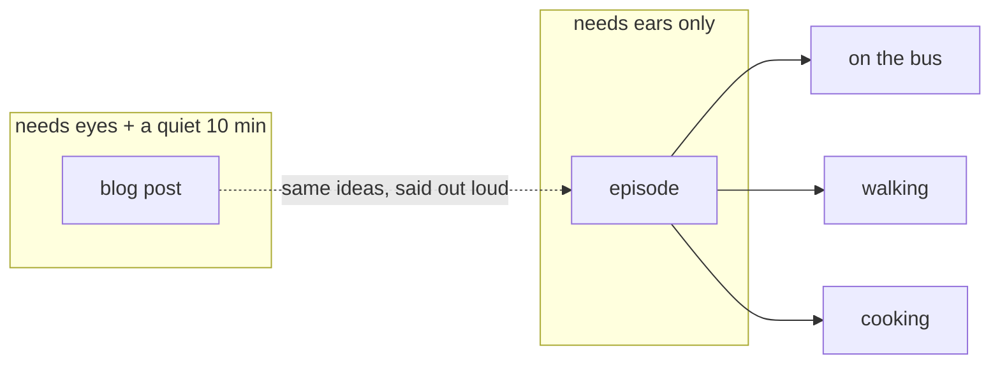

**Why it didn't just happen.** Making one episode by hand is ~1 hour —
rewrite for the ear, render, listen, fix, upload, paste the link back — times
two locales, per post. Nobody keeps that up, so the posts stayed text-only.

**Goal.** A pushed post becomes a published, embedded episode with no human in
the loop, at a bar an editor would sign off on — **or it stops and says why**.

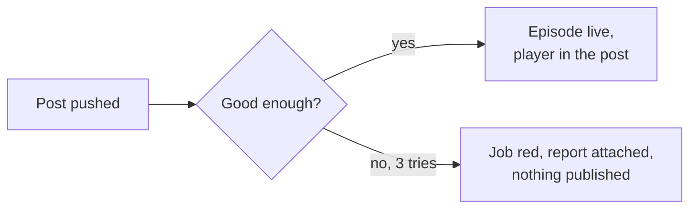

Both halves matter: unattended publishing without a gate is worse than no
podcast; a gate that needs a human click is not unattended.

---

## 2. What has to happen for a post to become an episode?

Four stages, one script file threaded through all of them.

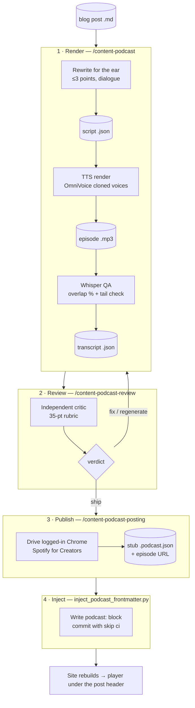

Why a rewrite and not a read-aloud: a post is written for a screen. Code,
URLs, tables, "see below" mean nothing with your eyes closed. The script keeps
the two or three ideas worth remembering and says them the way a person would.

---

## 3. How does one CI run actually play out?

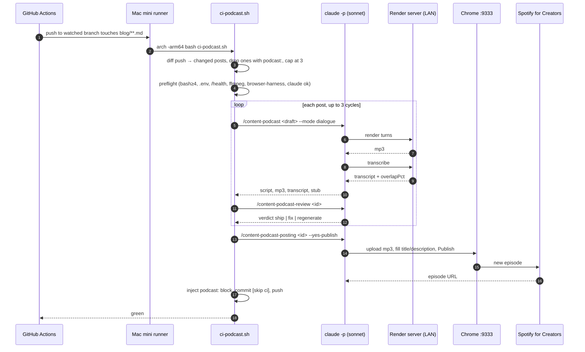

Every `claude -p` is `--model sonnet --effort medium`, pinned — the Mac and
the PC produce the same episode for the same push.

---

## 4. What happens when the critic says no?

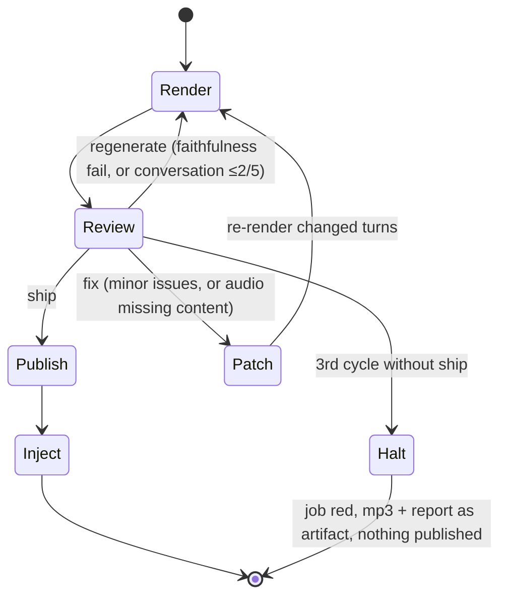

**Why three cycles, not two:** a `regenerate` followed by a `fix` is progress,
and the `fix` has not had its own attempt yet (observed 2026-09-12, VI).

**Why halt, not "ship the best attempt":** a bad or duplicate episode on a
public feed can only be deleted by hand in the Spotify dashboard. A red job
costs nothing, and a script that fails three independent reviews usually means
the *post* has a problem.

---

## 5. What do we run it on, and why not the cloud?

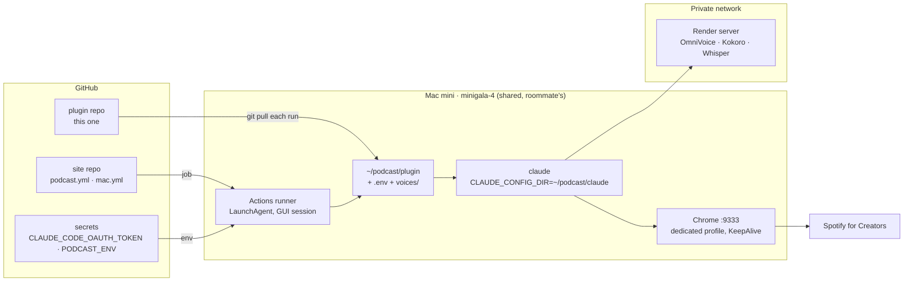

Three inputs a cloud runner cannot have:

| Need | Why cloud can't | What we did |
|---|---|---|
| TTS server | on a private LAN | self-hosted runner on the same network |
| Logged-in Spotify browser | no publishing API exists | dedicated Chrome with a debug port, session moved in by cookie hand-over |
| Voice clips + `.env` | not in a public repo | clips committed (no secrets in them), `.env` written from one secret at job start |

**The Mac is a roommate's.** Constraint: no hands on the box, nothing outside
one directory, one-line rollback. Everything was done through `mac.yml`
(a `workflow_dispatch` remote shell). Footprint: `~/podcast/`, one
LaunchAgent, three brew formulae. `runner/mac-plan.md` is the full record.

---

## 6. How did we get a logged-in Spotify on a machine nobody can touch?

Nobody types a password, ever. The session moves as cookies, through a
secret that lives for one hour.

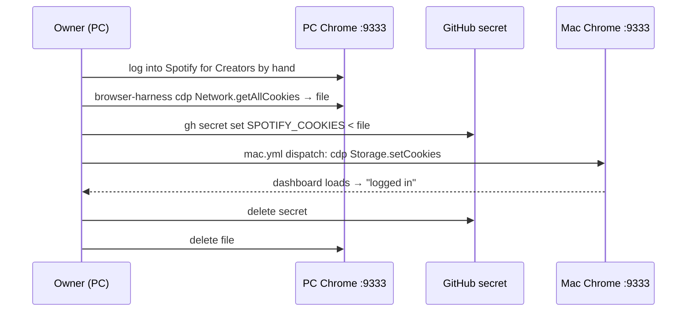

Kill switch: Spotify → "Sign out everywhere". Accepted risk: any repo writer
can read a repo secret by pushing a workflow — see §10.

---

## 7. What does an episode leave behind?

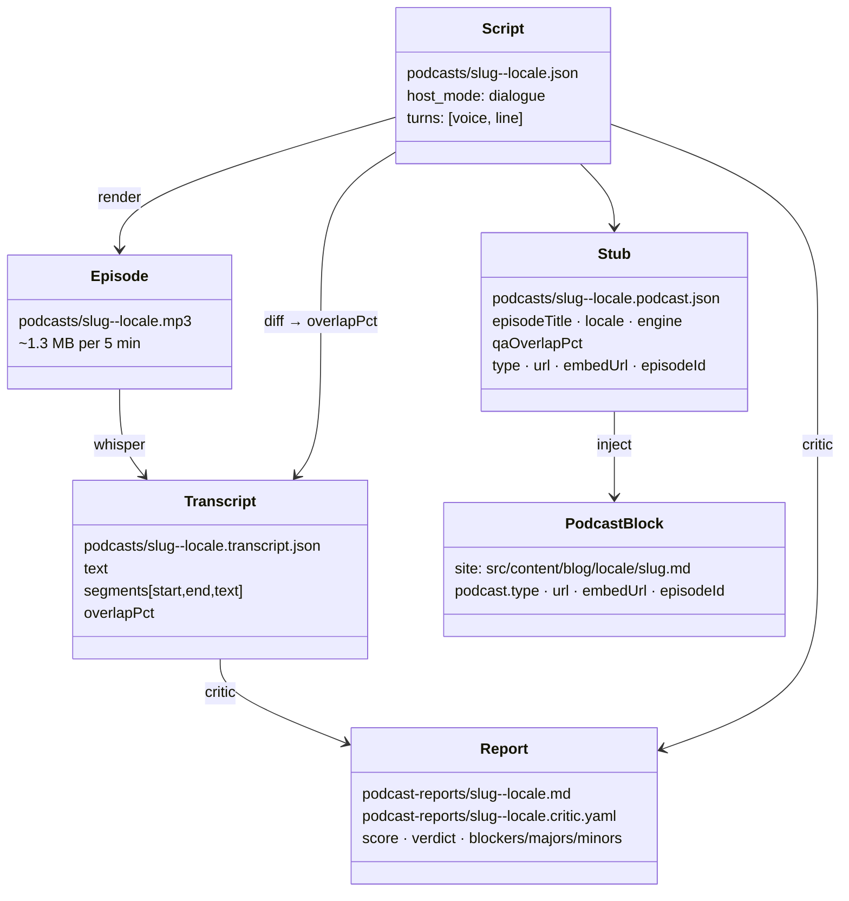

Only `PodcastBlock` is committed. Everything under `podcasts/` and
`podcast-reports/` is gitignored — the durable record of an episode is the
block in the post. No queue, no database: if the post has the block, the
episode exists.

```yaml
podcast:
  type: spotify
  url: 'https://open.spotify.com/episode/4xkWvFqmxLIj6gOUAjkxhK'
  embedUrl: 'https://open.spotify.com/embed/episode/4xkWvFqmxLIj6gOUAjkxhK'
  episodeId: '4xkWvFqmxLIj6gOUAjkxhK'
```

---

## 8. How do we know an episode is good enough?

An agent that never saw the render conversation scores script + transcript
against a fixed rubric. The writer grading its own work found nothing wrong
in every test — hence a separate grader.

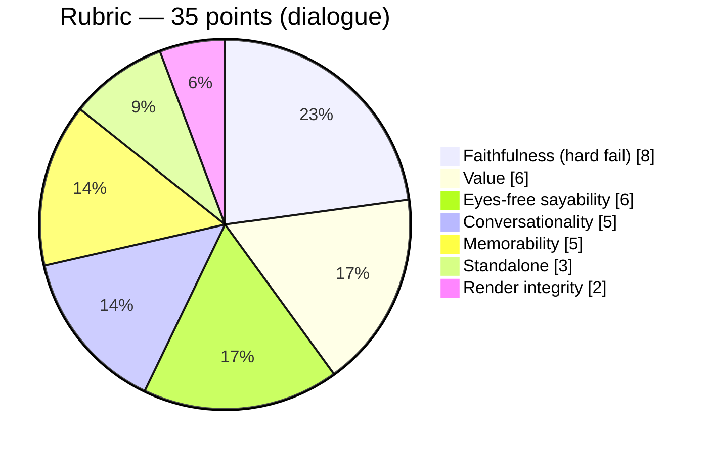

| Verdict | Condition |
|---|---|
| `ship` | ≥ 28/35 · faithfulness clean · overlap ≥ 85 % (or judged a Whisper artifact) · conversationality ≥ 4/5 |
| `fix` | ≥ 26/35 · faithfulness 8/8 — patch the named turns, re-render. Also whenever audio is missing something the script has |
| `regenerate` | anything else, and **always** on an invented claim or conversationality ≤ 2/5 |

Minors never block. Majors that block are what a listener would hear: missing
audio, garbled TTS, a claim the post never made. Two checks run *before* the
critic so it doesn't waste a cycle on them: Whisper overlap and a tail check
that the sign-off made it into the audio.

---

## 9. How good has it actually been?

| Date | Locale | Where | Cycles | Score | Wall time | Cycle-1 finding |
|---|---|---|---|---|---|---|
| 2026-09-12 | VI | PC | 2 | 34/35 | — | audio tail dropped (why cycles went 2→3) |
| 2026-09-17 | EN | Mac, unattended | 2 | 31 → **35/35** | ~50 min | sign-off missing from audio |
| 2026-09-17 | VI | Mac, unattended | 2 | 30 → **33/35** | 26 min | "copy the template from the post" (standalone), 4 non-reactive turns |

Where the 26 minutes went:

```mermaid
gantt
    title VI run 35200104702 — 2026-09-17
    dateFormat HH:mm
    axisFormat %H:%M
    section cycle 1
    render          :08:31, 8m
    review → fix    :08:39, 7m
    section cycle 2
    patch + render  :08:46, 3m
    review → ship   :08:49, 4m
    section publish
    Spotify UI      :08:53, 4m
    inject + push   :08:57, 1m
```

TTS and the critic's re-listen dominate; the model is not the bottleneck.
The lever is **not needing cycle 2**. Both cycle-1 failures were the same two
recurring findings; they are now rules and a check in the render skill
(`9f88dfe`).

**Known ceilings** — things the critic will never block on, so they persist
until fixed:

1. VI voice says "Claude" as "Cloud", every time. Voice artifact; fix is a
   phonetic spelling rule in the VI script, picked by a listen test.
2. Bare identifiers in VI (`npm`) get garbled — same fix.
3. EN Kokoro fallback clips hyphenated compounds — moot while OmniVoice is
   configured.

---

## 10. Why is it shaped this way?

**Why does `/content-podcast-all` refuse to auto-publish, but CI does?**
`--yes-publish` publishes irreversibly. It has exactly one call site,
`ci-podcast.sh`, and only after `ship`. By hand you always get the confirm.

**Why two loop guards on the inject commit?**

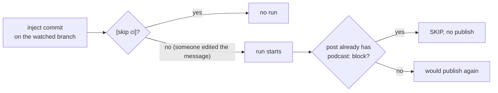

`[skip ci]` alone is one careless edit from a publish storm.

**Why check files instead of exit codes?** `claude -p` ends the session the
instant the agent returns. Twice the render stage backgrounded the job and
returned 0 with no mp3. Every stage checks the artifact exists.

**Why pin the model?** Without `--model`/`--effort`, `claude -p` inherits the
runner's `~/.claude/settings.json` — a different episode per machine.

**Why Sonnet and not Opus?** 35/35 on Sonnet; the time is in TTS and
listening, not in the model. Opus adds cost, not score.

**Why is the plugin pulled every run?** The Mac clone is a plain `git clone`;
nothing else updates it. Without the pull, fixes to the skills never reach
the runner.

**What risk did we accept?** Any of the repo's writers can read repo secrets
by pushing a workflow. Mitigation: move them to a GitHub *environment* with
required reviewers. Not done yet.

---

## 11. What's next?

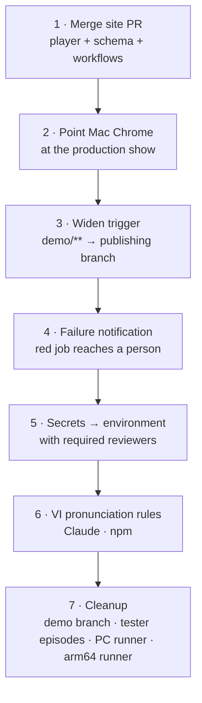

Not planned: a "ship anyway on cycle 3" mode. Revisit after the first real
halt.

---

## 12. Where is everything?

```
commands/        the four slash commands (thin; they point at skills)
skills/          the procedures: content-podcast (render), -review, -posting, -all
agents/          podcast-critic — the independent grader and its rubric
scripts/         ci-podcast.sh (CI entry) · call_remote.py / call_local.py (render, transcribe)
                 inject_podcast_frontmatter.py · runner-doctor.sh · setup-mac.sh · r2_upload.py
runner/          README (runner install, both OSes) · mac-plan.md (the Mac record) · service units
voices/          the four reference clips for cloning (EN ×2, VI ×2)
docs/            this file · 01 command reference · 02 tutorial
drafts/ podcasts/ podcast-reports/   working dirs, gitignored
```
