# 00 — How a blog post becomes a podcast episode with nobody watching

> Read this first. Each heading is a question we had to answer; under it is
> how we answered it, in plain words and a picture. No code needed to follow
> it. When you *do* want the commands, file names and settings:
> `01-pipeline.md` (reference), `02-workflow-tutorial.md` (by hand),
> `runner/` (the machine it runs on).

---

## 1. Why are we doing this at all?

**The reader's problem.** A blog post needs your eyes and ten quiet minutes.
Most of the day is not like that — the bus, the walk, the kitchen, the gym.
That is when people actually have room for an idea, and a post can't reach
them there. An episode can: press play, hands and eyes free, and it arrives
with the two or three things worth remembering.

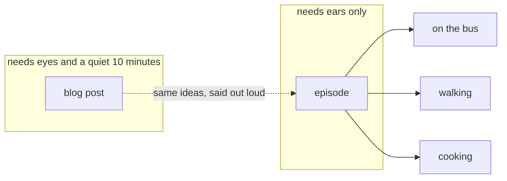

**Why it didn't just happen.** Making one episode by hand takes about an
hour: rewrite the post so it sounds spoken, generate the voices, listen, fix,
upload, paste the link back into the post. Twice, because the site is in
English and Vietnamese. Nobody keeps that up, so the posts stayed text-only.

**The goal.** When a post is published, an episode appears under it a short
while later, with nobody doing anything — *and* it is good enough that an
editor would have approved it. If it can't reach that bar, it stops and says
why instead of publishing something bad.

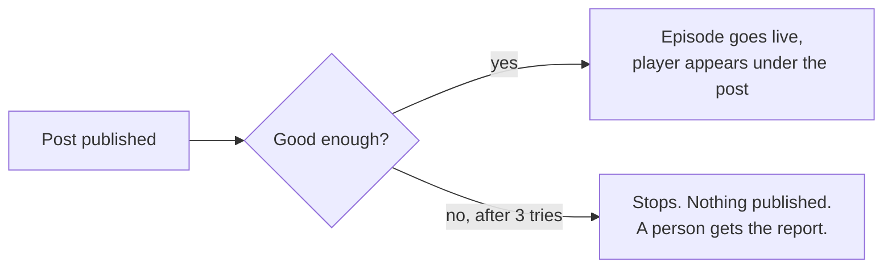

Both halves matter. Publishing without a quality check is worse than no
podcast. A quality check that needs a person to click "OK" is not automatic.

---

## 2. What has to happen for a post to become an episode?

Four steps. Think of it as a small production team where each role is played
by an AI with a specific job description.

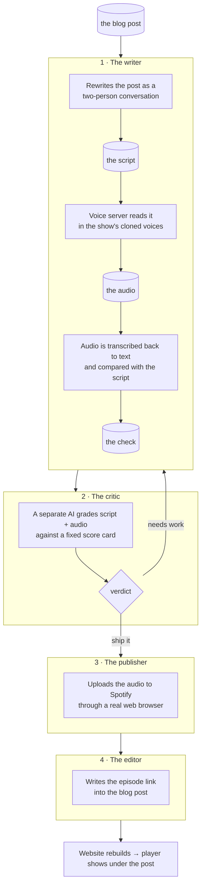

**Why rewrite instead of reading the post aloud?** A post is written for a
screen. Code, links, tables and "see below" mean nothing with your eyes
closed. The writer keeps the two or three ideas worth remembering and has two
voices talk them through the way people do — one explains, the other asks
what a listener would ask.

**Why transcribe the audio back?** It is the only way to know the voices
said what the script says. If a sentence went missing or a word came out
garbled, the text won't match, and we catch it before anyone listens.

---

## 3. How does one run actually play out?

Everything below happens on its own, on a Mac mini in someone's flat,
triggered by a post being published.

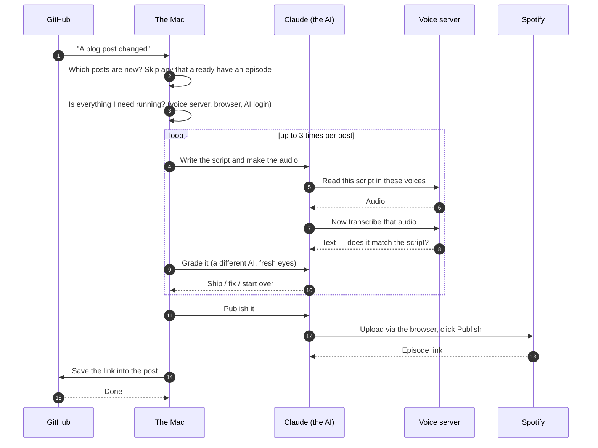

Every AI step uses the same model at the same settings, fixed in the script,
so the same post gives the same episode no matter which machine runs it.

---

## 4. What happens when the critic says no?

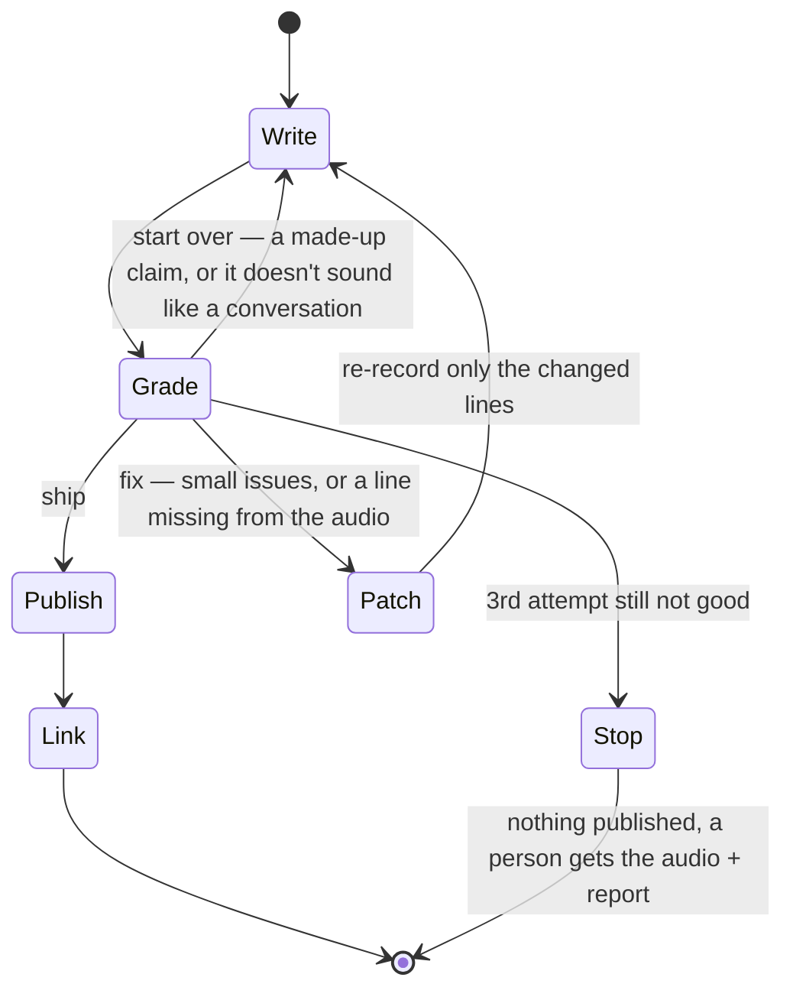

**Why three tries, not two?** We saw a case where try 1 needed a full
rewrite and try 2 only needed one line fixed — and with two tries it would
have stopped right there, one small fix from done.

**Why stop, not "publish the best attempt"?** A bad or duplicate episode on
a public feed can only be removed by hand in Spotify's dashboard. Stopping
costs nothing. And a script that fails three independent gradings usually
means the *post itself* has a problem worth a human look.

---

## 5. What does it run on, and why not in the cloud?

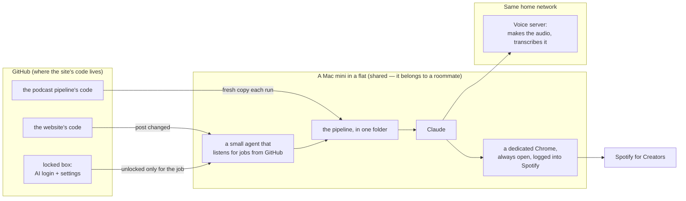

Three things a rented cloud machine can't have:

| It needs | Why the cloud can't | What we did instead |
|---|---|---|
| The voice server | it's a Mac on a home network, not on the internet | run the pipeline on a machine on the same network |
| A browser logged into Spotify | Spotify has no way for a program to upload episodes — only the website | keep a Chrome window open on that Mac, permanently logged in |
| The show's voice samples and settings | they aren't public | the samples are in the code; the settings are unlocked from GitHub's locked box only while a job runs |

**The Mac belongs to a roommate.** So the rules were: never touch the
keyboard, keep everything in one folder, be able to remove it all with one
command. The whole setup was done remotely, through GitHub, one step at a
time, with a written plan and a check after each step (`runner/mac-plan.md`
is that record).

---

## 6. How is that browser logged into Spotify if nobody can touch the Mac?

Nobody ever types a password. A website remembers you with a small "I'm
logged in" note stored in the browser — a cookie. We copied that note from a
browser on the owner's PC to the browser on the Mac.

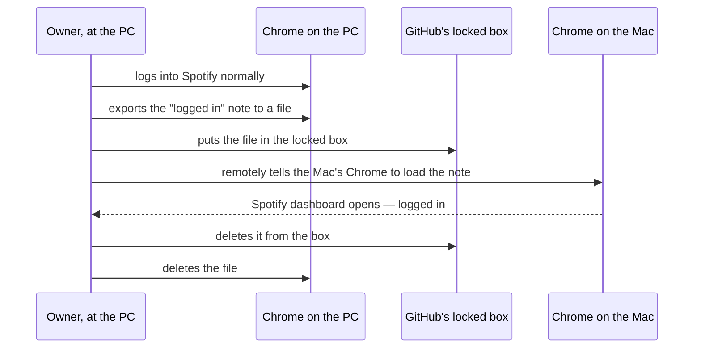

The note lived in the box for under an hour. If it ever leaks, Spotify's
"Sign out everywhere" button cancels it instantly.

---

## 7. What do you end up with?

Each run produces a handful of things. Only the last one is kept for good.

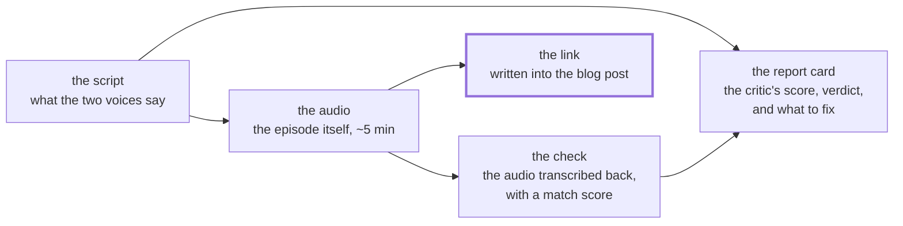

| What | Where it goes | Kept? |
|---|---|---|
| The script | on the Mac | no — regenerated every time |
| The audio | on the Mac, and on Spotify once published | Spotify keeps it |
| The check | on the Mac | no |
| The report card | on the Mac; attached to the job if the run stopped | until someone reads it |
| **The link in the post** | the website's code | **yes — this is the record** |

That last line is deliberate. There is no database and no list of episodes.
The blog post either has a podcast link in it or it doesn't. If it does, the
episode exists and the player shows. If it doesn't, the next run will make
one. Simple to reason about, nothing to keep in sync.

---

## 8. How do we know an episode is good enough?

A second AI — the critic — that never saw the writer's work-in-progress
grades the script and the audio against a fixed score card. We tried letting
the writer grade itself first; it found nothing wrong every single time.

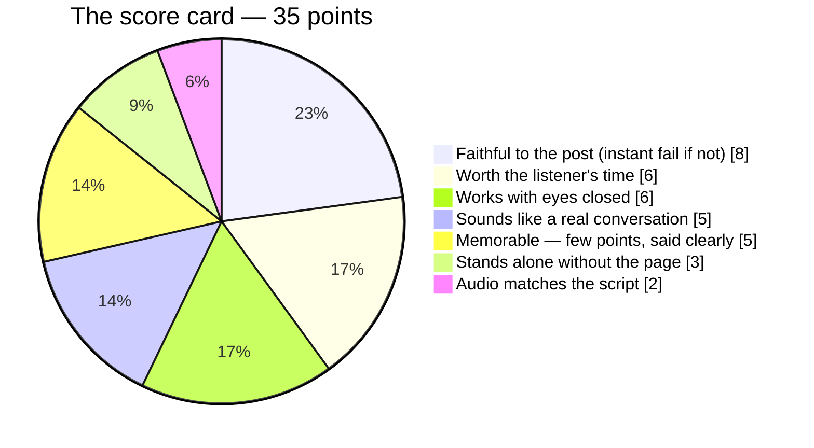

| Verdict | Means |
|---|---|
| **Ship** | 28 or more, nothing made up, audio matches, the two voices actually talk to each other |
| **Fix** | 26 or more and nothing made up — patch the lines the critic named, re-record just those |
| **Start over** | anything lower, and *always* if a claim isn't in the post or it reads like two monologues |

Small style issues never block. What blocks is what a listener would notice:
a missing sentence, a garbled word, a claim the post never made.

---

## 9. How good has it actually been?

| When | Language | Where | Tries | Score | Time | What the first try got wrong |
|---|---|---|---|---|---|---|
| 12 Sep | Vietnamese | the PC | 2 | 34/35 | — | the closing line was cut off in the audio |
| 17 Sep | English | the Mac, unattended | 2 | 31 → **35/35** | ~50 min | the closing line was cut off in the audio |
| 17 Sep | Vietnamese | the Mac, unattended | 2 | 30 → **33/35** | 26 min | said "copy the template from the post" without saying what's in it; four lines that didn't respond to the line before |

Where the 26 minutes went:

```mermaid
gantt
    title The Vietnamese run, 17 Sep
    dateFormat HH:mm
    axisFormat %H:%M
    section try 1
    write + record          :08:31, 8m
    grade → fix             :08:39, 7m
    section try 2
    patch + re-record       :08:46, 3m
    grade → ship            :08:49, 4m
    section publish
    upload to Spotify       :08:53, 4m
    link into the post      :08:57, 1m
```

Making the audio and the critic listening to it take the time; the AI's
thinking does not. So the way to get faster is to **not need a second try**.
Both first tries failed on the same two things, and those two things are now
rules the writer follows and a check it runs before handing over.

**Known weak spots** — the critic won't block on these, so they stay until
fixed:

1. The Vietnamese voice says "Claude" as "Cloud", every time. Fix: tell the
   writer to spell it the way the voice says it right; pick the spelling by
   listening to a few candidates.
2. English tech words inside Vietnamese ("npm") come out garbled — same fix.

---

## 10. Why is it built this way?

**Why does the by-hand version always ask "publish?", but the automatic one
doesn't?** Publishing can't be undone. When a person runs it, the person is
the safety check. When nobody runs it, the critic is — and the "skip the
question" switch exists in exactly one place, right after the critic says
ship.

**Why two safety catches on the "save the link" step?** Saving the link
changes the post. Changing a post is what triggers a run. Without a catch,
every episode would trigger another episode, forever.

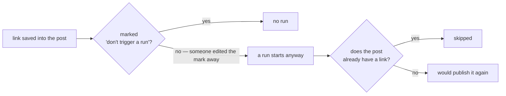

One catch is one careless edit away from an endless loop. Two is not.

**Why check that the files exist instead of trusting "done"?** Twice the
writer said "done" and had made no audio — it had started the recording in
the background and then ended its session, and the recording was lost. Now
every step checks the file is actually there.

**Why the mid-size AI model and not the biggest?** The best score is already
35/35 on it, and the time goes to making and listening to audio, not to
thinking. The biggest model would cost more and score the same.

**Why fetch a fresh copy of the pipeline every run?** Otherwise fixes made on
the PC never reach the Mac.

**What risk did we accept, knowingly?** Anyone who can push code to the
site's repository could read the locked box. The fix is a GitHub feature that
makes the box need a second person's approval. Not done yet — it's on the
list.

---

## 11. What's next?

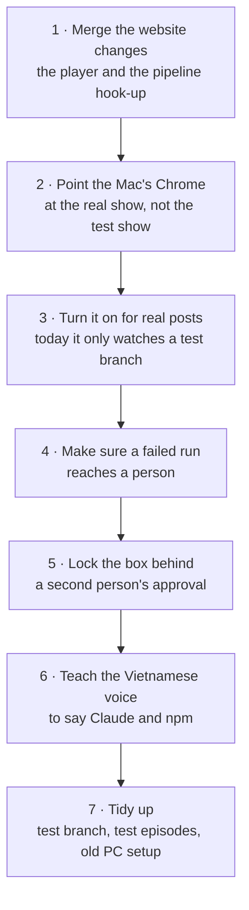

Not planned: a "publish the best attempt anyway" mode. We'll revisit after
the first real stop, not before.

---

## 12. For engineers: where the code is

```
commands/   the four slash commands            skills/    the step-by-step procedures each one follows
agents/     the critic and its score card      scripts/   the automation entry point, render/transcribe helpers, the link writer
runner/     how to set up a machine to run it  voices/    the four voice samples (EN ×2, VI ×2)
docs/       this file, the reference (01), the by-hand tutorial (02)
```
